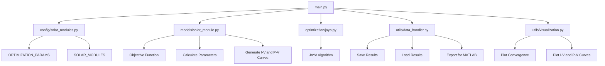

# Project Architecture Diagram

Below is the Mermaid diagram representing the architecture of the solar module optimization project:

### Explanation:
1. **`main.py`**:
   - Entry point of the application.
   - Interacts with all other modules.

2. **`config/solar_modules.py`**:
   - Contains solar module specifications and optimization parameters.

3. **`models/solar_module.py`**:
   - Defines the solar module model and its objective function.
   - Provides methods for calculating parameters and generating curves.

4. **`optimization/jaya.py`**:
   - Implements the JAYA optimization algorithm.

5. **`utils/data_handler.py`**:
   - Handles saving, loading, and exporting results.

6. **`utils/visualization.py`**:
   - Provides visualization tools for plotting convergence and curves.

This diagram provides a high-level overview of the project's architecture and the interactions between its components.